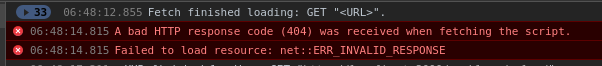

# dev-diary

This file is used 

* to publish progress on my work on 4clojure 
* and to have a log of problems i encountered.

This could be initial spark to provide PRs to other projects (myself) and possibly could be used for yet another "CLJ-beginner-experience-review" blog post.

## started with cljs ui

* first lines of code for navigation using secretary routing

## finished the first version of `speculative + expound` feature 

* ...by writing proper functions distinguishing between failed tests and spec errors.

## ugly first version of `speculative + expound` feature works

* the missing piece for correctly formatted error message was to just style the span used for the error messages like a pre (monospaced and whitespace)
* TODO i'll need to revisit the code though, mb i can write some test(s) to make sure i properly (still) handle any error-event correctly.

## pick up work after a way too long break of clj coding in my spare time

* instrument/unstrument works now properly (dont know exactly what i did wrong the last time though i did bump again some dep-versions.
* have a cursive remote repl session attached to nrepl server that i configured with ring options
* this finally makes it quite ez to move forward
* managed to display an expound-processed spec error message. needs formatting
* not sure whether to
    * add hiccup generating function for expound messages (expound pr?)
    * just provide the data required to build such a ui component outside of expound (i prefer this one)
    * i probably could just go ahead and print errors in a special text area and/or mb use [ansi](https://github.com/lambdaisland/ansi)
* fiddled around with expound in repl and looked into source code. i aim to finish a first correctly formatted version this week


## dev-setup and speculative (2019-02-27)

* switched back to using lein-ring plugin to get backend error messages
    * for some reason i get a strange error message <br> haven't looked into that for now. 
* was able to add speculative instrumentation to problem code evaluation (i was just missing the require-statement it seems... but due to lack of error messages before...)
* but i failed at setting the explain-printer of spec to expounds printer. for some reason clojure.spec.alpha/*explain-out* isn't visible to my namespace. 
    * this most certainly has something to do with the dependency mess I got right now. there are multiple sources atm for spec.alpha.
* must find a proper setup with repl-connections to clj and cljs repls - gonna reach out for help on this one probably
    * this might even be the time where i 
        * either fully understand how cursive works and what exactly it is capable of now
        * or try to learn emacs as i have a feeling that i might run into fewer troubles using a repl-connection with my IDE.

## speculative (2019-02-26)

* call to fn instrument breaks project - the symptom is that i cannot navigate any ring-routes besides the static ones.
I believe loading clj-namespaces crashes silently in my current dev-setup because i use `lein figwheel` with a ring-handler. I think i should be starting ring server and/or figwheel from a clj-repl. Need to learn about how figwheel does its job probably. i put the code for this into a separate branch for now until i changed the dev setup.
* my (timelimitted) attempt to change the dev setup ended up in a crashing app once i start figwheel from my clj-repl:
```
user=> (start! )
Figwheel: Starting server at http://0.0.0.0:3449
Figwheel: Watching build - dev
Compiling build :dev to "resources/public/js/compiled/app.js" from ["src/cljs"]...
Successfully compiled build :dev to "resources/public/js/compiled/app.js" in 2.183 seconds.
Figwheel: Starting CSS Watcher for paths  ["resources/public/css"]
nil
user=> IOException Resource temporarily unavailable
        java.io.FileInputStream.readBytes (FileInputStream.java:-2)
        java.io.FileInputStream.read (FileInputStream.java:255)
        java.io.BufferedInputStream.fill (BufferedInputStream.java:246)
        java.io.BufferedInputStream.read (BufferedInputStream.java:265)
        jline.internal.NonBlockingInputStream.read (NonBlockingInputStream.java:166)
        jline.internal.NonBlockingInputStream.read (NonBlockingInputStream.java:135)
        jline.internal.NonBlockingInputStream.read (NonBlockingInputStream.java:243)
        jline.internal.InputStreamReader.read (InputStreamReader.java:257)
        jline.internal.InputStreamReader.read (InputStreamReader.java:194)
        jline.console.ConsoleReader.readCharacter (ConsoleReader.java:2151)
        jline.console.ConsoleReader.readCharacter (ConsoleReader.java:2141)
        jline.console.ConsoleReader.readBinding (ConsoleReader.java:2226)
Bye for now!
 kazesberger   develop  …  clj  private  4clojure  lein --version
Leiningen 2.9.0 on Java 1.8.0_161 Java HotSpot(TM) 64-Bit Server VM

```

